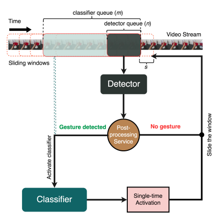
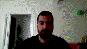
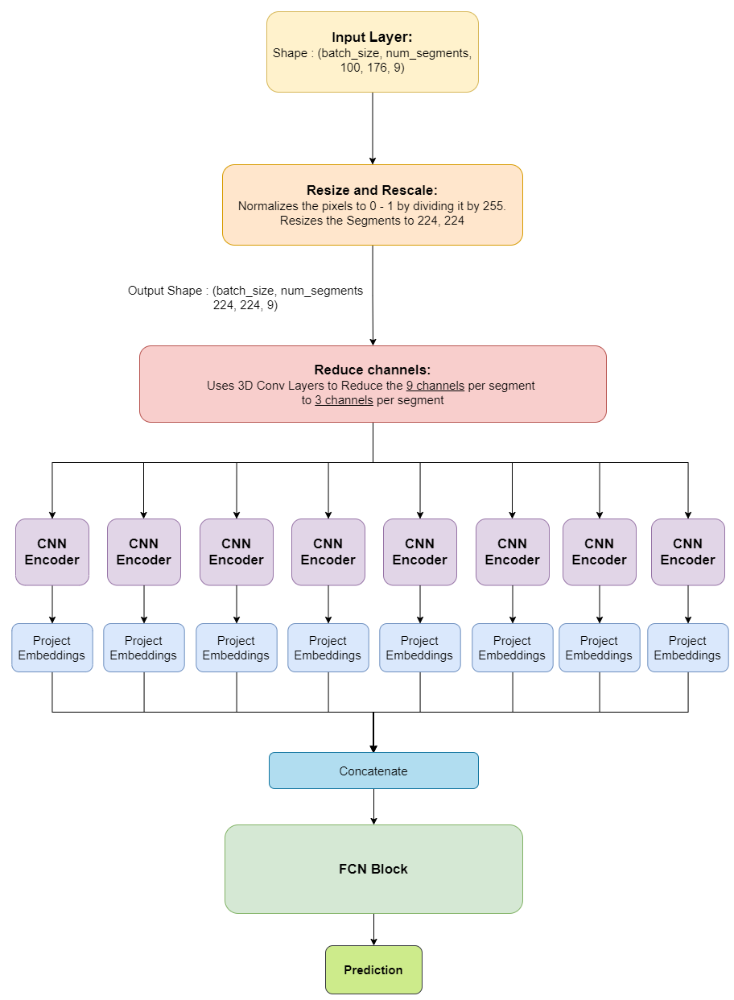
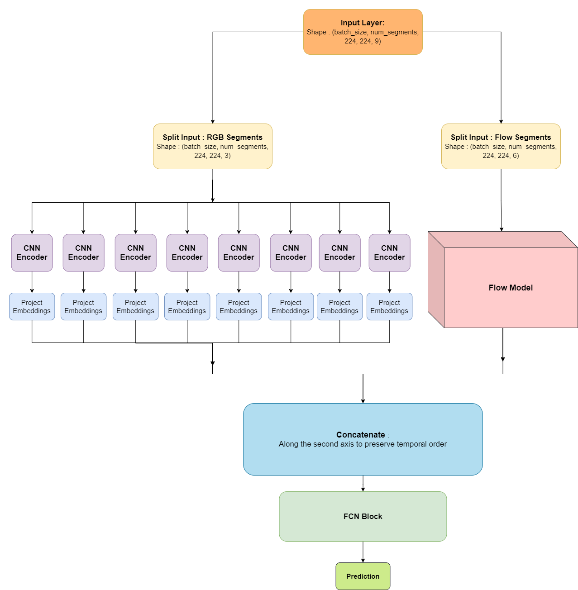
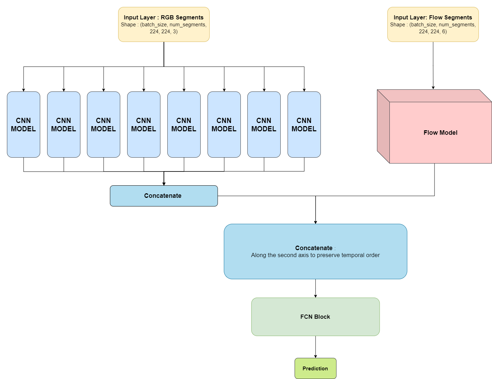

# Real-time Dynamic Gesture Recognition

**In this project I try to detect and classify hand gestures in real time. As with most of my projects, I try to learn by replicating the state of the art, understanding the theory and the implementation details.**

I tried to approach the problem of gesture recognition with two different methods:

- Using a Lightweight Detector and a Deep Classifier
- Using Motion Fused Frames (MFFs)

The data used for both these approaches come from the [20BN-jester Dataset](https://20bn.com/datasets/jester) .

First, let us take a quick look at what the dataset looks like.

### Jester Dataset:

There are more than 5000 examples per class for gesture classes and more than 12000 examples for "Doing Something Else" class.

Here are some examples from the Jester Dataset.

Gesture Classes :

    

Doing other things and Doing Nothing Classes :

 


# A Light Weight Detector And A Deep Classifier Approach

The inspiration for this method comes from the paper :

[Real-time Hand Gesture Detection and Classification Using Convolutional Neural Networks](https://arxiv.org/abs/1901.10323) By Okan Köpüklü, Ahmet Gunduz, etc. 



In this paper, the authors proposed an architecture which consists of two models, 

- A detector which is a a light weight, shallow 3D CNN for gesture detection.
- A Classifier which is a deep 3D CNN for gesture classification.

# Detector

Since the overall accuracy of this system highly depends on the performance of detector, it should be :

1. Robust.
2. Accurate in detecting the gestures.
3. Lightweight as it has to run continuously.

According to these points, I used a **3D-ResNet10** to build the detector as they did in the paper. It had around 1M parameters. 

### Training Details :

The detector was trained on 7 classes. Five of these classes were the gesture classes which were label with 1s. Two classes namely, "Doing Nothing" and "Doing other things" served as examples when no gesture was detected, hence they were labeled with 0s.

I used AdamW optimizer with learning rate = 1e-4 and weight decay = 1e-3 and I reduced the learning rate by a factor of 0.2 when the model plateaued.

The model was then trained for only 7 epochs.

### Results :

Even though, I used a lot less data overall (only 7 classes worth of data),  the detector achieved **83.5% validation accuracy**. I could also, quite easily, play around with the detection threshold to optimize for accuracy, sensitivity or specificity. Also, the detector which was a binary classifier performed much better than the detector which predicted a one hot vector.

 

# Classifier

A Classifier is a deep 3D CNN used for gesture classification. 

The classifier becomes **active only** **when the detector detects a gesture**. This is very critical since most of the time, no gesture is performed in real time gesture recognition applications. Therefore, there is no need to keep the high-performance classifier always active, which decreases the memory and power consumption of the system considerably.

Since there isn't any limitation regarding the size or complexity of the classifier, any architecture
providing a good classification performance could have been selected. I went with the **3D-ResNet101** which has about **84 million parameters**. 

## Training Details :

At first, since the detector passes on a clip to the classifier only if there is a gesture detected, I decided to train the classifier on the 5 gesture classes. But while evaluating the model, I came across a flaw in the model that it hadn't learnt to give low confidence values if there was no gesture. It was giving the confident predictions to multiple classes which looked quite randomly generated. To fix this mistake, I included "Doing Nothing" and "Doing other things" classes in the training data for the classifier which greatly improved its usability. 

The model was trained only for 7 epochs.

I used AdamW optimizer with learning rate = 1e-3 and weight decay = 1e-3 and I reduced the learning rate by a factor of 0.2 when the model plateaued.  

### Results :

The classifier achieved a **validation accuracy of 85.9%** which was quite impressive considering it was not pretrained on other datasets and only had 7 classes worth videos to train on. The weights from the 7th epoch are used in the classifier

 


---

# Using Motion Fused Frames

The inspiration for this method comes from the paper : 

[Motion Fused Frames: Data Level Fusion Strategy for Hand Gesture Recognition](https://arxiv.org/abs/1804.07187) By Okan Köpüklü, Neslihan Köse, Gerhard Rigoll, etc.


Figure 1

In this paper, the authors improve performance and reduce the computation by creating motion fused frames(MFFs). 

They are composed by fusing motion information into static RGB image.

To create MFFs from a video:

1. We need to calculate Optical Flow Frames using consecutive previous frames.
2. We then need to append these frames to the RGB frames as extra channels as shown in fig 1.
3. Taking one RGB frame, and appending 3 optical flow frames to it will give us one segment.
4. Each video of the [20BN-jester Dataset](https://20bn.com/datasets/jester) is then converted into 8 equidistant MFF segments.

With these 8 segments for each video, the input data was preprocessed. For the input pipeline I used [tf.data.Dataset](https://www.tensorflow.org/api_docs/python/tf/data/Dataset) .

The dimensions of the final training data were :

```python
 [(batch_size, 8, 224, 224, 3), (batch_size, 8, 224, 224, 6), (batch_size, num_gestures)]. 
```

The first tuple in the list has all the RGB images for all 8 segments

The second tuple houses all the optical flow frames we have constructed. Every optical flow frame has 2 channels namely, u and v as optical flow captures movement in 2 dimensions. 

The third tuple, is the y input to the model. "num_gestures" is the number of gestures I tried to predict as practicing on the entire Jester Dataset would require a lot of computational power. 

# MFF Data

The videos were preprocessed by [**Aditya Soni**](https://github.com/Dasyud). 

The optical flow representation can directly describe the velocity of each individual pixel point in the image. He calculated the horizontal and the vertical components of the optical flow frames by implementing the Brox flow since it had been experimentally proven that it performs better compared to the MPEG flow or the Farneback techniques.  

    

# Architectures


This is the architecture used in the paper.

Since our data looked vastly different than the what was ideal, I had to try multiple different architectures and try to optimize the performance on this new dataset.

Here are some of the architectures I tried.

## The **First Architecture** :

 In the First Version of the architecture, the x_input to the model was in the shape of (batch_size, 8 (segments), 224, 224, 9). 9 channels in each segment are made up of 3 RGB channels and 6 flow channels. **The CNN encoder shares its weights across all the segments.**



## **Second Architecture :**

In this architecture, I decided to **remove** the **Reduce Channels Block** because it was a relatively small network which is incapable of reducing the data as much as it needed to do. **Basically, the model was losing a lot a data very early on.**

To fix this drawback, The second architecture had separation of the RGB channels and the Flow channels at Input. The Flow channels go into a separate "**Flow Model**" which is a **3D - ResNet type architecture** to get their embeddings. These embeddings were then concatenated with the RGB embeddings calculated in the same way as in the First architecture.



## **Third Architecture** **:**

This Architecture is the best performing architecture**.** It is more optimized, faster and more accurate than the Second Architecture. I also found that the model finds it easier to backpropagate gradients with this architecture. Here, **the CNN Model shares its weights across all segments**.



# Results

I ruled the MFF approach as an overall failure because :

1. It only reached **50% validation accuracy**.
2. It was slow.
3. It was needlessly complicated.

We should also note that even though the overall approach was a failure, the architecture was performing aptly. The root cause of the problem was how **noisy** the extracted **MFF data** was. Nevertheless, working on this, **helped me master** a lot of important concepts such as **building custom train and test steps**, custom call functions and in general **building complex custom model architectures**.

# Code

This section houses the code for some of the architectures used in this project. 

You can find the entire code for this project in my [Github repository](https://github.com/Joy-Lunkad/Real-time-Dynamic-Gesture-Recognition).

### Detector :

```python
def conv_block(inputs, F, stage, strides = (2,2,2)):
    base_name = f'conv_{stage}'
    bn_axis = 4

    x = layers.Conv3D(F, (1, 1, 1), strides = strides,
                        kernel_initializer='he_normal')(inputs)
    x = layers.BatchNormalization(axis=bn_axis)(x)
    x = layers.Activation('relu')(x)
    
    x = layers.Conv3D(F, kernel_size=(3, 3, 3), padding = 'same',
                        kernel_initializer = 'he_normal', 
                        name = base_name + '_1')(x)
    x = layers.BatchNormalization(axis=bn_axis)(x)
    x = layers.Activation('relu')(x)

    x = layers.Conv3D(F, kernel_size=(3, 3, 3), padding = 'same',
                        kernel_initializer = 'he_normal', 
                        name = base_name + '_2')(x)
    x = layers.BatchNormalization(axis=bn_axis)(x)
    x = layers.Activation('relu')(x)

    shortcut = layers.Conv3D(F, (1, 1, 1), strides = strides,
                            kernel_initializer='he_normal')(inputs)
                             
    x = layers.add([x, shortcut])
    x = layers.Activation('relu')(x)

    return x
```

```python
def build_model(input_dims, F, model_name):
    input_layer = layers.Input(shape=input_dims)
    x = layers.Conv3D(F, (3,3,7), strides = (1, 2, 2),
                            padding='same',
                            name = 'conv1')(input_layer)
    x = layers.BatchNormalization(axis=4)(x)
    x = layers.Activation('relu')(x)
        
    x = layers.MaxPool3D(pool_size=(3,3,3), strides=(2,2,2), 
                            name = 'pool1')(x)

    x = conv_block(x, F * 2, stage = 2)
    x = conv_block(x, F * 4, stage = 3)
    x = conv_block(x, F * 8, stage = 4)

    x = layers.GlobalAveragePooling3D()(x)
    pred = layers.Dense(units = 1, activation='sigmoid')(x)

    return tf.keras.Model(input_layer, pred, name = model_name)
```

```python
resnet10 = build_model(detector_input_shape, 16, detector_name)
```

### Classifier Code :

```python
def identity_block(inputs, filters):
    F1, F2, F3 = filters
    bn_axis = 4
    
    x = layers.Conv3D(F1, 3, padding='same')(inputs)
    x = layers.BatchNormalization(axis=bn_axis)(x)
    x = layers.Activation('relu')(x)

    x = layers.Conv3D(F2, 3, padding='same')(x)
    x = layers.BatchNormalization(axis=bn_axis)(x)
    x = layers.Activation('relu')(x)

    x = layers.Conv3D(F3, 3, padding='same')(x)
    x = layers.BatchNormalization(axis=bn_axis)(x)
    x = layers.Activation('relu')(x)
    x = layers.add([x, inputs])
    x = layers.Activation('relu')(x)
    
    return x
```

```python
def conv_block(inputs, filters, stage, strides = (2,2,2)):
    base_name = f'conv_{stage}'
    bn_axis = 4
    F1, F2, F3 = filters
    x = layers.Conv3D(F1, (1, 1, 1), strides = strides,
                        kernel_initializer='he_normal')(inputs)
    x = layers.BatchNormalization(axis=bn_axis)(x)
    x = layers.Activation('relu')(x)
    
    x = layers.Conv3D(F2, kernel_size=(3, 3, 3), padding = 'same',
                        kernel_initializer = 'he_normal', 
                        name = base_name + '_1')(x)
    x = layers.BatchNormalization(axis=bn_axis)(x)
    x = layers.Activation('relu')(x)

    x = layers.Conv3D(F3, kernel_size=(3, 3, 3), padding = 'same',
                        kernel_initializer = 'he_normal', 
                        name = base_name + '_2')(x)
    x = layers.BatchNormalization(axis=bn_axis)(x)
    x = layers.Activation('relu')(x)

    shortcut = layers.Conv3D(F3, (1, 1, 1), strides = strides,
                            kernel_initializer='he_normal')(inputs)
                             
    x = layers.add([x, shortcut])
    x = layers.Activation('relu')(x)

    return x
```

```python
def build_model(input_dims, F, model_name):
    input_layer = layers.Input(shape=input_dims)
    x = layers.Conv3D(64, (3,3,7), strides = (1, 2, 2),
                            padding='same',
                            name = 'conv1')(input_layer)
    x = layers.BatchNormalization(axis=4)(x)
    x = layers.Activation('relu')(x)
        
    x = layers.MaxPool3D(pool_size=(3,3,3), strides=(2,2,2), 
                            name = 'pool1')(x)

    x = conv_block(x, [128, 128, 256], stage = 2)
    x = identity_block(x, [128, 128, 256])

    x = conv_block(x, [256, 256, 512], stage = 3)
    x = identity_block(x, [256, 256, 512])
    x = identity_block(x, [256, 256, 512])

    x = conv_block(x, [512, 512, 1024], stage = 4)
    x = identity_block(x, [512, 512, 1024])
    
    x = layers.GlobalAveragePooling3D()(x)
    pred = layers.Dense(units = len(idx_labels), activation='softmax')(x)

    return tf.keras.Model(input_layer, pred, name = model_name)
```

```python
resnet101 = build_model(classifier_input_shape, F = 64, classifier_name)
```

### MFF Third Architecture Code:

```python
num_projection_layers=1
projection_dims=512
flow_out_dims=512
dropout_rate=0.1
unresized_image_shape = (100, 176, 3)
unresized_flow_shape = (8, 100, 176, 6)
resized_flow_shape = (8, 224, 224, 6)
rgb_shape = (224, 224, 3)
fcn_input_shape = (8, (projection_dims + flow_out_dims))
```

```python
def project_embeddings_block(embeddings, num_projection_layers, projection_dims, dropout_rate):
    embeddings = layers.GlobalAvgPool2D()(embeddings)
    projected_embeddings = layers.Dense(units = projection_dims)(embeddings)
    for _ in range(num_projection_layers):
        x = tf.nn.gelu(projected_embeddings)
        x = layers.Dense(projection_dims)(x)
        x = layers.Dropout(dropout_rate)(x)
        x = layers.Add()([projected_embeddings, x])
        projected_embeddings = layers.LayerNormalization()(x)
    return projected_embeddings
```

```python
def identity_block(inputs, filters):
    filters1, filters2, filters3 = filters
    bn_axis = 4
    
    x = layers.Conv3D(filters1, 3, padding='same')(inputs)
    x = layers.BatchNormalization(axis=bn_axis)(x)
    x = layers.Activation('relu')(x)

    x = layers.Conv3D(filters2, 3, padding='same')(x)
    x = layers.BatchNormalization(axis=bn_axis)(x)
    x = layers.Activation('relu')(x)

    x = layers.Conv3D(filters3, 3, padding='same')(x)
    x = layers.BatchNormalization(axis=bn_axis)(x)
    x = layers.Activation('relu')(x)
    x = layers.add([x, inputs])
    x = layers.Activation('relu')(x)
    
    return x
```

```python
def conv_block(inputs, filters, strides = (1, 2, 2)):
    filters1, filters2, filters3 = filters
    bn_axis = 4
    
    x = layers.Conv3D(filters1, (1, 1, 1), strides = strides,
                      kernel_initializer='he_normal')(inputs)
    x = layers.BatchNormalization(axis=bn_axis)(x)
    x = layers.Activation('relu')(x)

    x = layers.Conv3D(filters2, (3, 3, 3), padding='same',
                      kernel_initializer='he_normal')(x)
    x = layers.BatchNormalization(axis=bn_axis)(x)
    x = layers.Activation('relu')(x)

    x = layers.Conv3D(filters3, (1, 1, 1),
                      kernel_initializer='he_normal')(x)
    x = layers.BatchNormalization(axis=bn_axis)(x)

    shortcut = layers.Conv3D(filters3, (1, 1, 1), strides = strides,
                             kernel_initializer='he_normal')(inputs)
    shortcut = layers.BatchNormalization(axis=bn_axis)(shortcut)

    x = layers.add([x, shortcut])
    x = layers.Activation('relu')(x)

    return x
```

```python
# flow encoder takes --> a tensor of (batch_size, resized_flow_shape) as input
# and outputs --> a tensor of (batch_size, 8, 256)
def create_flow_encoder(resized_flow_shape):
    inputs = layers.Input(shape = resized_flow_shape, name = 'flow_encoder_input')   
    bn_axis = 4
    
    x = layers.Conv3D(64, (7, 7, 7),
                      strides=(1, 2, 2),
                      padding='same',
                      kernel_initializer='he_normal')(inputs)
    x = layers.BatchNormalization(axis=bn_axis)(x)
    x = layers.Activation('relu')(x)

    x = layers.MaxPooling3D((1, 3, 3), strides=(1, 2, 2))(x)

    x = conv_block(x, [64, 64, 256], strides=(1, 1, 1))
    x = identity_block(x, [64, 64, 256])
    x = identity_block(x, [64, 64, 256])
    
    x = conv_block(x, [128, 128, 512])
    x = identity_block(x, [128, 128, 512])
    x = identity_block(x, [128, 128, 512])

    x = conv_block(x, [256, 256, 1024])
    x = conv_block(x, [256, 256, 512])
    x = conv_block(x, [256, 256, 512])
    x = conv_block(x, [512, 512, 512])
    # output_shape of (8, 2, 2, 256)
    x = layers.MaxPool3D((1, 2, 2))(x)
    x = layers.Reshape((8, 512))(x)
    return tf.keras.Model(inputs, x)

def create_flow_model(flow_encoder, resized_flow_shape):
    # scrap reduce_channels concept
    inputs = layers.Input(shape = (resized_flow_shape), name = 'flow_input')
    embeddings = flow_encoder(inputs)
    return tf.keras.Model(inputs = inputs, outputs = embeddings, name = 'flow_model')

flow_encoder = create_flow_encoder(resized_flow_shape)
flow_model = create_flow_model(flow_encoder, resized_flow_shape)
```

```python
def create_cnn_model(cnn_encoder, project_embeddings_block):
    rgb_batch = layers.Input(shape = rgb_shape)
    embeddings = cnn_encoder(rgb_batch)
    embeddings = project_embeddings_block(embeddings, num_projection_layers, projection_dims, dropout_rate)
    return tf.keras.Model(rgb_batch, embeddings, name = 'cnn_model')

cnn_encoder = tf.keras.applications.InceptionV3(include_top=False, input_shape=(rgb_shape[0], rgb_shape[1], 3))
cnn_encoder.trainable = True
cnn_output_shape = cnn_encoder.output_shape[1:]
cnn_model = create_cnn_model(cnn_encoder, project_embeddings_block)

def create_fcn_model(fcn_input_shape, dropout_rate):
    """
    input : should be a fusion of all the embeddings created. 2 * 512 dimensional
    embeddings for each segment. 1 for rgb and 1 for the u, v flow images
    output : should be a softmax prediction 
    """
    
    inputs = layers.Input(shape = fcn_input_shape, name = 'fcn_input')
    x = layers.Flatten()(inputs)
    projected_embeddings = layers.Dense(units = 2048)(x)
    x = tf.nn.gelu(projected_embeddings)
    x = layers.Dense(2048, activation='gelu')(projected_embeddings)
    x = layers.Dropout(dropout_rate)(x)
    x = layers.Add()([projected_embeddings, x])
    x = layers.LayerNormalization()(x)
    x = layers.Dense(1024, activation='gelu')(x)
    pred = layers.Dense(5, activation='softmax')(x)

    return tf.keras.Model(inputs = inputs, outputs = pred, name = 'fcn_model')

fcn_model = create_fcn_model(fcn_input_shape, dropout_rate)
```

```python
class Gesture_Model(tf.keras.Model):
    def __init__(self, cnn_model, flow_model, fcn_model, batch_size, **kwargs):
        super(Gesture_Model, self).__init__(**kwargs)
        
        self.cnn_model = cnn_model
        self.flow_model = flow_model 
        self.fcn_model = fcn_model

        self.loss_tracker = tf.keras.metrics.Mean(name = 'loss')
        self.accuracy_tracker = tf.keras.metrics.CategoricalAccuracy(name = 'accuracy')
        self.batch_size = batch_size
        
    @property
    def metrics(self):
        return [self.loss_tracker, self.accuracy_tracker]

    def call(self, segments, training = False):
        with tf.device("/gpu:0"):
            rgb_segments, flow_segments = segments
            batch_embeddings = []
    
		        for i in range(self.batch_size):
                rgb_batch  = rgb_segments[i, :, :, :, :]
                embeddings = cnn_model(rgb_batch, training = training)   
                batch_embeddings.append(embeddings)

            rgb_embeddings = tf.stack(batch_embeddings)
            flow_encodings = flow_model(flow_segments, training = training)

            concat = tf.concat([rgb_embeddings, flow_encodings], axis = 2)

            pred = fcn_model(concat, training = training)

            return pred

    def compute_loss(self, y_true, pred):
        return tf.keras.losses.categorical_crossentropy(y_true, pred)

    def train_step(self, data):
        rgb_segments, flow_segments, y_true = data
        with tf.GradientTape() as tape:
            
            pred = self((rgb_segments, flow_segments), training = True)
            loss = self.compute_loss(y_true, pred)

        gradients = tape.gradient(loss, self.trainable_variables)
        self.optimizer.apply_gradients(zip(gradients, self.trainable_variables))
  
	      self.loss_tracker.update_state(loss)
        self.accuracy_tracker.update_state(y_true, pred)

        return {'loss' : self.loss_tracker.result(), 
		'accuracy' : self.accuracy_tracker.result()
		}

    def test_step(self, data):
        rgb_segments, flow_segments, y_true = data
        
        pred = self((rgb_segments, flow_segments), training = False)
        loss = self.compute_loss(y_true, pred)
        
        self.loss_tracker.update_state(loss)
        self.accuracy_tracker.update_state(y_true, pred)
        
	return {'val_loss' : self.loss_tracker.result(), 
		'val_accuracy' : self.accuracy_tracker.result()
		}

gesture_model = Gesture_Model(cnn_model, flow_model, fcn_model, batch_size)

gesture_model.compile(
    optimizer=tfa.optimizers.AdamW(learning_rate=0.001, weight_decay=0.001),
    metrics = ['accuracy']
)
```
